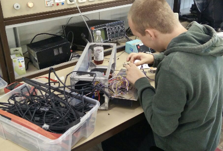

 

Van knipperleds tot een labvoeding, van een elektronische vingerhoedpiano tot een accumeter voor drones. De elektronica afdeling van DJO kent vele interesses. 
Op de elektronica afdeling van DJO mag jij je eigen projecten verzinnen en maken. Of het nou een knipperled is of een labvoeding, een accumeter of een microfoonversterker, een zaklamp of een sirene, het maakt niet uit. De begeleiders helpen je daar waar nodig. Arduino's en Raspberry Pi zijn ook populair en daarmee zie je steeds meer verbinding met informatica. Bij DJO vinden we dat dat niet zo gescheiden hoeft te zijn.

 Wat voorbeelden van wat zoal gemaakt is:

- Labvoeding
- Led Cube met 64 leds
- Zaklantaarn van restmateriaal en een "lege" batterij.
- Geluidengenerator.
- Elektronische dobbelsteen.
- Regelbare voeding.
- Coilgun
- QuadCopter
- Koelbox mbv Peltier Elementen
- Woordklok
