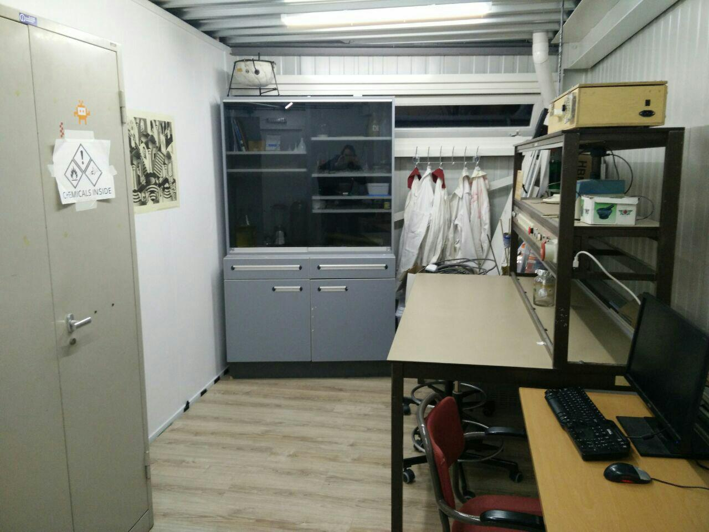

Scheikunde is de leer van de elementen en de verbindingen waaruit stoffen bestaan.
Alles om je heen bestaat uit deeltjes, met scheikunde kun je leren hoe je deze deeltjes kunt beïnvloeden en aanpassen.

Bij de DJO Scheikunde afdeling word op een leuke en veilige manier geleerd wat scheikunde nu precies is en wat je er mee kan.
Hieronder vallen onder andere molberekeningen, zuur/base reacties, extracties, destillaties

{.img-fluid}
Bij alle scheikundige DJO experimenten zal tenminste 1 gediplomeerde scheikunde begeleider zijn.